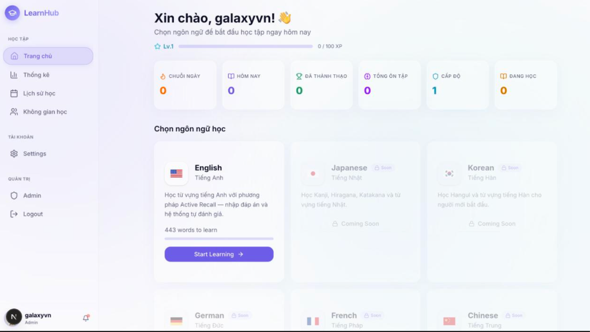
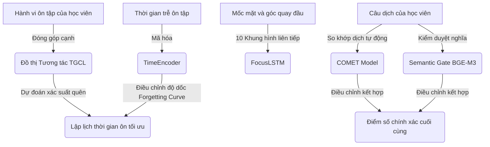

<div align="center">

# 🧠 LearnHub - AI-Powered Spaced Repetition Portfolio

[](https://nextjs.org/)
[](https://fastapi.tiangolo.com/)
[](https://pytorch.org/)
[](https://tailwindcss.com/)
[](https://bun.sh/)
[](https://sqlite.org/)

**LearnHub** là một nền tảng học từ vựng tiếng Anh đột phá, tích hợp Trí tuệ Nhân tạo (AI), học máy thời gian thực (Real-time ML) và khoa học nhận thức (Cognitive Science) giúp tối ưu hóa hiệu quả ghi nhớ của người học. Nền tảng được thiết kế với giao diện cao cấp, mượt mà và hỗ trợ không gian cộng tác trực tuyến thời gian thực.

---



*Hình ảnh giao diện bảng điều khiển chính (Dashboard) của LearnHub với các chỉ số thống kê và danh sách ngôn ngữ học.*

</div>

---

## 🌟 1. Tính năng nổi bật (Features)

Hệ thống **LearnHub** vượt trội hơn các ứng dụng học từ vựng truyền thống nhờ sự kết hợp các tính năng công nghệ thông minh sau:

*   **Học thông minh dựa trên Lặp lại ngắt quãng (AI Spaced Repetition)**:
    *   Tích hợp mô hình Học máy Đồ thị Thời gian (**TGCL** - Temporal Graph Contrastive Learning) chạy trực tiếp dựa trên lịch sử làm bài của học viên. Tự động dự đoán xác suất quên từ vựng (Recall Probability) để đề xuất thời điểm ôn tập kế tiếp tối ưu nhất.
    *   Hỗ trợ **Online Learning** (học máy thích ứng ngay sau từng câu trả lời) và **Batch Training** (huấn luyện đồng loạt lại toàn bộ đồ thị theo yêu cầu).
    *   Tự động kích hoạt cơ chế dự phòng thông minh (Fallback) sang thuật toán cổ điển **SuperMemo SM-2** khi mô hình học máy chưa sẵn sàng.
*   **Tự động Chấm điểm Ngữ nghĩa & Ngữ cảnh (Context-aware Auto-Grading)**:
    *   Sử dụng mô hình **COMET** (`wmt22-cometkiwi-da`) đánh giá chất lượng bản dịch trực tiếp từ câu gốc mà không cần khớp từ ngữ mẫu tuyệt đối.
    *   Tích hợp **BGE-M3 Multilingual Embedding** làm cổng kiểm duyệt ngữ nghĩa (**Semantic Gate**) nhằm loại bỏ trường hợp COMET chấm điểm nhầm đối với các câu trả lời không liên quan.
    *   Chế độ dự phòng tự động sang thuật toán khoảng cách Levenshtein (Levenshtein Distance) kết hợp chuẩn hóa và loại bỏ dấu tiếng Việt thông minh (ví dụ: `"xin chao"` tự khớp `"xin chào"`).
*   **Theo dõi Độ tập trung bằng Thị giác Máy tính (Vision-based Focus Tracking)**:
    *   Sử dụng Camera để theo dõi trạng thái gương mặt học viên, đo đạc tỷ lệ mở mắt (EAR - Eye Aspect Ratio), độ mở miệng (MAR - Mouth Aspect Ratio) và góc quay đầu (Pitch, Yaw, Roll).
    *   Sử dụng mô hình mạng nơ-ron hồi quy **LSTM (FocusLSTM)** chạy trên PyTorch để phát hiện trạng thái xao nhãng hoặc buồn ngủ của học viên theo thời gian thực.
*   **Không gian học tập Cộng tác thời gian thực (Collaborative Virtual Study Hub)**:
    *   Máy chủ WebSocket được xây dựng trên Bun tốc độ cao, cho phép học viên trong phòng cùng theo dõi trạng thái học tập của nhau, gửi tin nhắn chat và thả hiệu ứng emoji lơ lửng màn hình.
*   **Hệ thống Gamification & Leveling**:
    *   Tích lũy điểm kinh nghiệm (XP) dựa trên độ khó từ vựng và chất lượng phản xạ câu trả lời.
    *   Hệ thống huy hiệu (Badges) năng động giúp tạo động lực học tập: *First Blood* (Học từ đầu tiên), *Night Owl* (Học đêm muộn), *Scholar* (100+ từ), *Master* (Làm chủ 10+ từ), *Streaks* (Chuỗi ngày liên tục).

---

## 📂 2. Cấu trúc Dự án (Project Structure)

Dự án được cấu trúc rõ ràng giữa hai phần Frontend (Next.js) và Backend (FastAPI) kèm các module Machine Learning chuyên sâu:

```
ELearn-hub-portfolio/
├── README.md                           # File hướng dẫn chính của dự án (root)
└── ELearn-hub-portfolio/               # Thư mục mã nguồn chính của ứng dụng
    ├── backend/                        # 🐍 Python FastAPI Backend
    │   ├── main.py                     # Entry point chính của backend FastAPI
    │   ├── database.py                 # Cấu hình kết nối cơ sở dữ liệu SQLite & ORM
    │   ├── models.py                   # Mô hình cơ sở dữ liệu (User, Vocabulary, ReviewLog, Badges, v.v.)
    │   ├── schemas.py                  # Pydantic schemas cho API request/response
    │   ├── seed.py                     # Khởi tạo dữ liệu từ vựng và tài khoản mẫu ban đầu
    │   ├── spaced_repetition.py        # Logic thuật toán Spaced Repetition SM-2
    │   ├── grader.py                   # Hệ thống chấm điểm tự động tích hợp COMET + BGE-M3 Semantic Gate
    │   ├── gamification.py             # Hệ thống tính điểm XP, cấp độ (Level) và Huy hiệu (Badges)
    │   ├── routers/                    # Router chia nhỏ theo các module chức năng chính
    │   │   ├── auth.py, user.py, flashcard.py, vocabulary.py, focus.py, review_logs.py
    │   └── ml_model/                   # 🧠 Nơi quản lý các mô hình học máy (Machine Learning)
    │       ├── model.py                # Định nghĩa lớp mô hình TGCL (PyTorch)
    │       ├── predict.py              # Xử lý suy diễn (predict), cập nhật online và batch train cho TGCL
    │       ├── focus_tracker.py        # Định nghĩa mạng FocusLSTM phân tích EAR/MAR/Headpose từ camera
    │       ├── best_model_lstm.pth     # File weights của mô hình FocusLSTM đã được huấn luyện sẵn
    │       └── tgcl_learned.pth        # Weights của mô hình TGCL tự động lưu lại sau khi học từ hành vi người dùng
    ├── src/                            # 💻 Next.js Frontend (TypeScript) & Socket Server
    │   ├── socket-server.ts            # WebSocket server kết nối Bun thời gian thực cực nhanh cho học nhóm
    │   ├── app/                        # Next.js App Router (các trang chính của hệ thống)
    │   │   ├── layout.tsx, page.tsx
    │   │   ├── workspace/              # Khu vực học tập chính
    │   │   │   ├── page.tsx            # Lựa chọn chế độ học
    │   │   │   └── hub/                # Study Hub cộng tác thời gian thực
    │   │   └── heatmap/                # Biểu đồ đóng góp (Contribution Heatmap) giống Github
    │   ├── components/                 # Các UI component có thể tái sử dụng (Shadcn + Framer Motion)
    │   └── hooks/                      # Custom hooks cho việc kết nối API/WebSocket
    ├── public/                         # Các tài nguyên tĩnh (Hình ảnh, Logo, Banner)
    │   └── learnhub_banner.png         # Banner chất lượng cao của dự án
    ├── package.json                    # Khai báo các thư viện phụ thuộc của Frontend & Bun
    ├── tailwind.config.ts              # Cấu hình giao diện CSS Tailwind
    ├── tsconfig.json                   # Cấu hình TypeScript
    └── start-all.bat                   # Kịch bản khởi chạy đồng thời Backend, Frontend & WebSocket nhanh chóng
```

*Các liên kết mã nguồn chính quan trọng:*
*   [main.py](file:///Users/hohung/Downloads/ELearn-hub-portfolio/ELearn-hub-portfolio/backend/main.py): Entry point của API.
*   [spaced_repetition.py](file:///Users/hohung/Downloads/ELearn-hub-portfolio/ELearn-hub-portfolio/backend/spaced_repetition.py): Bộ lập lịch dự phòng thuật toán SM-2.
*   [grader.py](file:///Users/hohung/Downloads/ELearn-hub-portfolio/ELearn-hub-portfolio/backend/grader.py): Bộ tự động chấm điểm dịch ngữ nghĩa.
*   [model.py](file:///Users/hohung/Downloads/ELearn-hub-portfolio/ELearn-hub-portfolio/backend/ml_model/model.py): Kiến trúc mạng đồ thị nơ-ron TGCL.
*   [focus_tracker.py](file:///Users/hohung/Downloads/ELearn-hub-portfolio/ELearn-hub-portfolio/backend/ml_model/focus_tracker.py): Bộ suy diễn tập trung FocusLSTM.
*   [socket-server.ts](file:///Users/hohung/Downloads/ELearn-hub-portfolio/ELearn-hub-portfolio/src/socket-server.ts): Máy chủ WebSocket viết bằng Bun.
*   [start-all.bat](file:///Users/hohung/Downloads/ELearn-hub-portfolio/ELearn-hub-portfolio/start-all.bat): Script khởi chạy nhanh trên Windows.

---

## 🚀 3. Hướng dẫn Chạy & Kiểm thử (Setup & Testing)

### 📋 Yêu cầu hệ thống trước khi cài đặt:
*   **Python**: Phiên bản 3.10 trở lên.
*   **Node.js** (v18+) hoặc **Bun** (v1.1+) — *Khuyến nghị dùng Bun để có hiệu suất chạy WebSocket tốt nhất*.
*   **uv**: Công cụ quản lý và cài đặt thư viện Python tốc độ cao (khuyên dùng, cài bằng `pip install uv`).

---

### 💻 Cách 1: Khởi chạy nhanh (Chỉ áp dụng trên Windows)

Chỉ cần chạy file script tự động [start-all.bat](file:///Users/hohung/Downloads/ELearn-hub-portfolio/ELearn-hub-portfolio/start-all.bat) bằng cách kích đúp vào tệp hoặc chạy lệnh dưới đây tại thư mục dự án:
```cmd
start-all.bat
```
Script sẽ tự động kiểm tra phần mềm, tạo môi trường ảo Python `.venv`, cài đặt thư viện, khởi chạy Backend FastAPI (cổng 3001), WebSocket Server (cổng 3002) và Frontend Next.js (cổng 3000) cùng một lúc.

---

### 🛠️ Cách 2: Khởi chạy thủ công (Windows, macOS, Linux)

#### Bước 1: Thiết lập cấu hình môi trường
Sao chép cấu hình mẫu `.env.example` thành `.env` tại thư mục chính `ELearn-hub-portfolio`:
```bash
cp ELearn-hub-portfolio/.env.example ELearn-hub-portfolio/.env
```
Mở file `.env` mới tạo và điền mã Token HuggingFace của bạn vào trường `HF_TOKEN`.

> [!TIP]
> Nếu bạn muốn thay đổi thư mục lưu trữ cache của các mô hình AI lớn khi tải về máy để tránh đầy ổ đĩa hệ thống, hãy đặt biến môi trường `HF_HOME`:
> - **Linux/macOS**: `export HF_HOME="/duong-dan-moi/huggingface-cache"`
> - **Windows PowerShell**: `$env:HF_HOME = "D:\duong-dan-moi\huggingface-cache"`

#### Bước 2: Khởi chạy Python Backend
```bash
cd ELearn-hub-portfolio/backend

# Tạo môi trường ảo
python -m venv .venv

# Kích hoạt môi trường ảo
# Trên Linux/macOS:
source .venv/bin/activate
# Trên Windows CMD:
.venv\Scripts\activate
# Trên Windows PowerShell:
.venv\Scripts\Activate.ps1

# Cài đặt các thư viện cần thiết
pip install -r requirements.txt
# Cài đặt thư viện PyTorch và mạng nơ-ron đồ thị (Dành cho dòng máy tính thường)
pip install -r requirements-torch.txt --extra-index-url https://download.pytorch.org/whl/cpu

# Khởi chạy server FastAPI
uvicorn main:app --host 0.0.0.0 --port 3001 --reload
```

#### Bước 3: Khởi chạy WebSocket Server (Yêu cầu Bun)
Mở một cửa sổ Terminal mới:
```bash
cd ELearn-hub-portfolio
bun src/socket-server.ts
```

#### Bước 4: Khởi chạy Next.js Frontend
Mở một cửa sổ Terminal mới:
```bash
cd ELearn-hub-portfolio
bun install        # Hoặc dùng: npm install
bun run dev        # Hoặc dùng: npm run dev
```

Sau khi hoàn tất, hãy truy cập vào địa chỉ [http://localhost:3000](http://localhost:3000) để trải nghiệm nền tảng.

---

### 🧪 Hướng dẫn chạy Kiểm thử (Testing)

Dự án cung cấp bộ kiểm thử tích hợp (integration tests) và kiểm thử gamification cho backend. 

Để thực hiện chạy kiểm thử:
1. Đảm bảo môi trường ảo Python đã được kích hoạt.
2. Chạy lệnh kiểm thử bằng thư viện `pytest`:
```bash
cd ELearn-hub-portfolio/backend
pytest tests/
```

> [!NOTE]
> Bạn có thể trực tiếp kiểm tra và tương tác thử nghiệm với các API của hệ thống thông qua tài liệu Swagger UI tự động tại địa chỉ: [http://localhost:3001/docs](http://localhost:3001/docs) sau khi khởi chạy Backend thành công.

---

## 📑 4. Các khái niệm khoa học chủ chốt

Hệ thống **LearnHub** được xây dựng dựa trên các nghiên cứu khoa học vững chắc về nhận thức học tập và AI:



### 1. Temporal Graph Contrastive Learning (TGCL) - Lặp lại ngắt quãng bằng Đồ thị
*   **Nguyên lý khoa học**: Đường cong quên lãng (Forgetting Curve) chứng minh rằng trí nhớ con người suy giảm theo hàm mũ, nhưng tốc độ quên sẽ chậm dần sau mỗi lần ôn tập thành công.
*   **Cách thức hoạt động**: TGCL xây dựng một mạng lưới đồ thị liên kết. Mỗi nút trên đồ thị đại diện cho một từ vựng, các cạnh liên kết giữa các nút thể hiện lịch sử và chuỗi trình tự ôn tập của người học kèm thông số thời gian giãn cách (Time Deltas).
*   **Học máy thời gian thực (Online Learning)**: Khác với các mô hình tĩnh chỉ nạp dữ liệu một lần, sau mỗi câu trả lời của học viên, mô hình nạp dữ liệu phản hồi (Rating từ 1-4 và thời gian trả lời) và thực hiện ngay 3 bước tối ưu hóa Gradient nhằm tinh chỉnh bộ Convolutional và Classifier, giúp mô hình luôn cá nhân hóa chính xác theo tốc độ học tập riêng của người dùng.

### 2. Thuật toán SuperMemo SM-2 (Fallback Algorithm)
*   **Nguyên lý khoa học**: Thuật toán cổ điển tính toán thời gian lặp lại tối ưu dựa trên ba tham số: Cấp số lặp lại ($n$), Ease Factor ($EF$ - Độ dễ của từ, mặc định khởi tạo $2.5$), và Khoảng thời gian giãn cách tính theo ngày ($I$).
*   **Công thức cập nhật**:
    $$EF' = EF + (0.1 - (5 - q) \times (0.08 + (5 - q) \times 0.02))$$
    Trong đó $q$ là điểm đánh giá chất lượng phản xạ (quy đổi từ thang điểm 1-4 của hệ thống sang thang 0-5 gốc của SM-2). Khi học viên đánh giá từ ở mức kém ($q < 3$), hệ thống thiết lập lại số lần ôn tập thành công liên tiếp về $0$ và khoảng thời gian ôn tập quay về $1$ ngày.

### 3. Chấm điểm dịch thuật tự động sử dụng COMET & Semantic Gate (BGE-M3)
*   **COMET** (`Unbabel/wmt22-cometkiwi-da`): Là mô hình deep learning được huấn luyện chuyên sâu cho tác vụ đánh giá chất lượng dịch máy (Quality Estimation). COMET đánh giá độ tương đồng ngữ nghĩa một cách tự nhiên mà không bị rập khuôn bởi từ vựng chuẩn.
*   **Semantic Gate (Cổng ngữ nghĩa)**: Vì COMET đôi khi mắc lỗi "ảo giác" (nhận định các từ có cùng ngữ cảnh nhưng sai nghĩa là bản dịch tốt), hệ thống đưa thêm tầng xử lý phụ bằng mô hình nhúng văn bản đa ngôn ngữ **BGE-M3**. BGE-M3 tính toán vector tương đồng ngữ nghĩa thực chất của câu trả lời và đáp án gốc. Nếu tương đồng ngữ nghĩa quá thấp, hệ thống sẽ tự động hạ điểm và kích hoạt phạt nặng (Penalize) kết quả chấm điểm của COMET, bảo đảm việc đánh giá kết quả học tập luôn chính xác 100%.

### 4. Phân tích độ tập trung thời gian thực (FocusLSTM)
*   **Chỉ số sinh trắc học gương mặt**:
    *   **EAR (Eye Aspect Ratio)**: Được tính dựa trên khoảng cách giữa các điểm mốc mắt.
        $$\text{EAR} = \frac{||p_2 - p_6|| + ||p_3 - p_5||}{2||p_1 - p_4||}$$
        Khi chỉ số EAR hạ xuống dưới $0.20$ trong thời gian dài phản ánh trạng thái buồn ngủ hoặc mắt nhắm.
    *   **MAR (Mouth Aspect Ratio)**: Tương tự như EAR nhưng đo độ mở của miệng để nhận diện cử chỉ ngáp.
    *   **Head Pose Estimation**: Phân tích góc nghiêng và quay đầu (Pitch - cúi gật, Yaw - quay trái phải, Roll - nghiêng đầu). Góc Yaw lớn hơn $10^{\circ}$ chứng tỏ học viên đang không nhìn vào màn hình.
*   **FocusLSTM**: Chuỗi 10 khung hình liên tiếp của 5 thông số trên được chuyển qua mô hình hồi quy LSTM gồm 2 tầng ẩn. Mô hình sẽ phân tích mối liên hệ trình tự thời gian của các chuyển động để phân loại trạng thái học viên đang tập trung (Focused) hay xao nhãng (Distracted) một cách mượt mà và chính xác.

---

## ✍️ 5. Tác giả & Tham khảo

### 👤 Tác giả chính:
*   **Hùng Hồ** - Nhà phát triển chính của dự án.
*   GitHub: [@Hungho09](https://github.com/Hungho09)

---

### 📑 Tài liệu tham khảo học thuật:
1.  **Woźniak, P. (1990)**. *Optimization of learning*. Nghiên cứu nền tảng và tài liệu thuật toán SuperMemo SM-2. [Tài liệu chính thức](https://www.supermemo.com/en/archives1990-2015/english/ol/sm2).
2.  **Rei, R., et al. (2020)**. *COMET: Efficient and Robust Evaluation of Machine Translation*. Kỷ yếu hội thảo WMT 2020. [GitHub Project](https://github.com/Unbabel/COMET).
3.  **Chen, J., et al. (2024)**. *BGE-M3: A Versatile Multi-Language, Multi-Granularity, and Multi-Function Retrieval Model*. Nghiên cứu về mô hình Embedding đa ngôn ngữ hiệu năng cao BGE. [Hugging Face](https://huggingface.co/BAAI/bge-m3).
4.  **Kazemi, V., & Sullivan, J. (2014)**. *One Millisecond Face Alignment with an Ensemble of Regression Trees*. Hội nghị CVPR 2014 — Thuật toán phát hiện Landmark khuôn mặt phục vụ tính toán chỉ số EAR/MAR.
5.  **Hochreiter, S., & Schmidhuber, J. (1997)**. *Long Short-Term Memory*. Neural Computation — Nghiên cứu nền tảng về kiến trúc mạng LSTM áp dụng trong phân tích chuỗi chuyển động tập trung gương mặt.